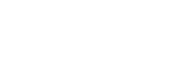
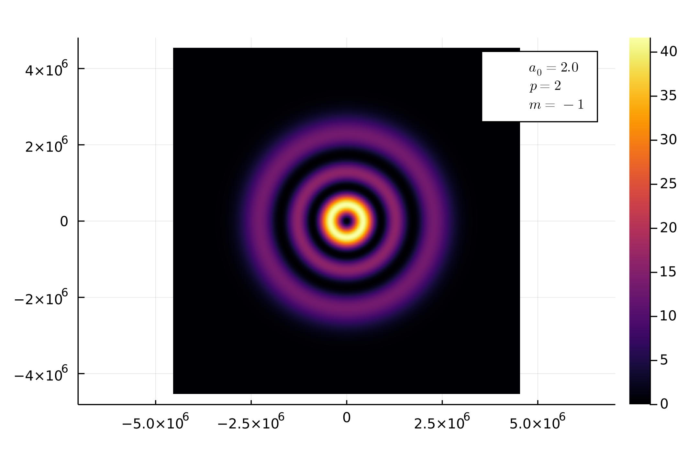
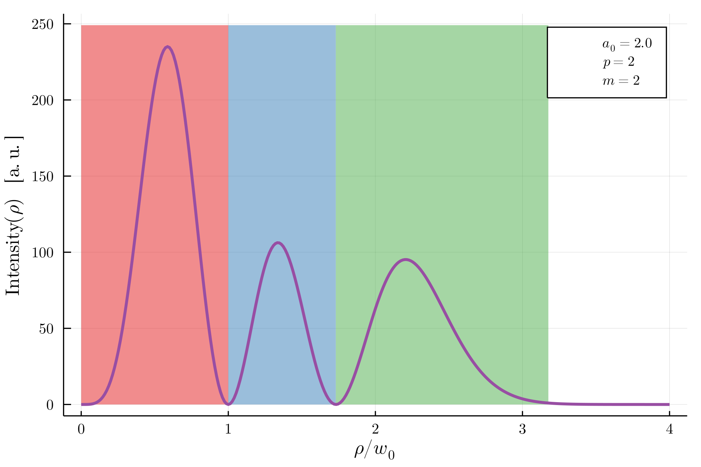

# Electrodynamic Simulations of an Ensemble of Charged Particles

This is a script written in [Julia](https://github.com/JuliaLang/julia) for simulating an ensemble of charged particles using manifest covariant equations of motion.

<!-- $$
\begin{aligned}
\frac{\mathrm{d}x^\mu}{\mathrm{d} \tau}\left(\tau\right) &= u^\mu(\tau) \\ \frac{\mathrm{d}u^\mu}{\mathrm{d}\tau}\left(\tau\right) &= \frac{q}{m} u^\rho(\tau) g_{\rho\nu} F^{\mu\nu}(x^\mu(\tau))
\end{aligned}
$$ --> 

<!-- <div align="center"></div> -->

<div align="center"></div>

## Physical Parameters

At the moment the simulation does not take into account electromagnetic field emissions due to charge change in velocity. 

To set the physical paramters, please manually modify the following codeblock found in [electrodynamic-sims.jl](https://github.com/toma-vlad/electrodynamic-simulations/blob/main/electrodynamic-sims.jl).

```
const N = 25_000 # number of particles, for each ring, 4N for radius averaging
const c = 137.036 # speed of light
const ω = 0.057; const T₀ = 2π/ω # angular frequency, period
const k = ω*c # wavevector
const λ = c*T₀ # wavelength
const w₀ = 75 * λ # is the waist radius
const a₀ = 2.; const AA = a₀*c # (qA₀)/(mc) = a₀
const w = 10.; const τ = w/ω; # temporal pulse decay time given in terms of number of oscilations and frequency 
const n = 5 # number of periods to integrate before and after pulse collides with particles 
const π₀ = a₀*c # in atomic units, a₀mc has units of linear momentum and sets the scale for linear momentum transfered to the particle, not that m = 1 for our particles
const maxR = 3w₀ # maximum radius for distributing praticles
```
The fields are provided by [LaserTypes.jl](https://github.com/SebastianM-C/LaserTypes.jl), using analytical formulas and returned as the Faraday tensor .  

<!-- $$
F^{\mu\nu}(x^\rho)
$$ --> 

## Integrating the Equations of Motion
The script loops over all provided laser configurations. For each type, using tabulated minima (or a decay of at least 1/100 from peak), initial conditions overlaying regions of interests will be generated. 

In the figure below, the intensity of a Laguerre-Gauss mode with right-handed transverse circular polarization, radial number `p = 2` and `m = -1` is shown

<div align = "center"></div>

Given this field pattern, the zone of interest are the 3 high intensity rings. For each zone `N` initial conditions will be generated.
```
R0 = [UniformAnnulus(w₀*p.roots[j], w₀*p.roots[j+1])[1] for i in 1:N]
```
All particles start with `z = 0` i.e., in a XY-plane circle, around the origin. 

Next we integrate the equations of motion using  [DifferentialEquations.jl](https://github.com/SciML/DifferentialEquations.jl), namely 

```
M = solve(eprob, Vern9(), EnsembleThreads(), abstol=1e-9, reltol=1e-9,
    saveat = (τf-τi)/time_samples, trajectories = 4N)
```
and through `M` we have access to the 4-position, the 4-velocity, the [angular/boost momentum tensor](https://en.wikipedia.org/wiki/Relativistic_angular_momentum#4d_Angular_momentum_as_a_bivector) at every time step, for every particle. Our `output_func` returns for each particle a list at at regular time samples in the form of the function `Mμν(v)`.
```
    function Mμν(v)
    x⁰, x¹, x², x³, u⁰, u¹, u², u³ = v
    Lx = x²*u³ - x³*u²
    Ly = x³*u¹ - x¹*u³
    Lz = x¹*u² - x²*u¹
    # Nx = x¹*u⁰ - x⁰*u¹
    # Ny = x²*u⁰ - x⁰*u²
    # Nz = x³*u⁰ - x⁰*u³
    L² = Lx^2 + Ly^2 + Lz^2
    # N² = Nx^2 + Ny^2 + Nz^2
    #the physical quantities are m* [1,2,3] , m^2*[4], m/c* [5,6,7] , m^2/c^2*[8],
    return (Lx = Lx, Ly = Ly, Lz = Lz, L² = L², #Nx = Nx, Ny = Ny, Nz = Nz, N² = N²,
            x⁰ = x⁰, x¹ = x¹, x² = x², x³ = x³, u⁰ = u⁰, u¹ = u¹, u² = u², u³ = u³)
end
```

## Statistics

Since we are dealing with a statistical ensemble, we look for collective behaviour through means. There are two kinds of means done in this script.

- Time-wise: the relevant quantities are averaged using [ThreadsX.jl](https://github.com/tkf/ThreadsX.jl)
```
function Particle_Avg(M,J)
    [ThreadsX.sum(getproperty(M[i][t], J)
    for i in 1:N)/N for t in 1:time_samples+1]
end
```
- Radius-wise (in the transverse plane): the relevant quantities get averaged over equidistant rings in the XY plane for their initial coordinates. The averaging is sped up by sorting the initial conditions according to `ρ`.
```
RHO = [UniformAnnulus(0,maxR) for i in 1:4N] 
RHOVec = VectorOfArray(RHO)
idx = sortperm(RHO, lt=(x,y)->x[2]<y[2])
R1 = RHOVec[1,:][idx]
```

## Plots 

In order to facilitate pretty graphics, trial and error lead to a solution utilizing [Serialization.jl](https://github.com/JuliaLang/julia/tree/master/stdlib/Serialization). This way, all plot objects will be saved, grouped in `plot_data` lists for each `sim_name` and saved as is in binary form (without file ending). 
```
serialize("$(sim_name)", plot_data)
```

They can then be reloaded and modified using the usual [Plots.jl](https://github.com/JuliaPlots/Plots.jl), just use 
```
myplots = deserialize("name")
```
and modify the plot elements as you would a regular plot.

## field_plots.jl

This file contains the code used to generate some useful plots which give information about the fields we study. For example azimuthally mediated electromagnetic field energy for Laguerre-Gauss mode `p = 2` and `m = 2`:

<div align = "center"></div>

Here, the tabulated roots are used to highlight the separated regions where the initial conditions are genereated in [electrodynamic-sims.jl](https://github.com/toma-vlad/electrodynamic-simulations/blob/main/electrodynamic-sims.jl).